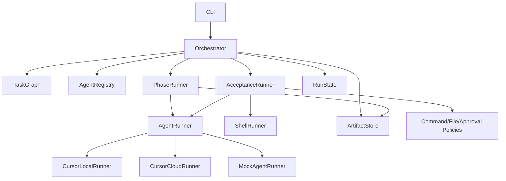

# Architecture

## Overview

Cursor Orchestrator separates **workflow definition**, **execution**, **acceptance**, and **persistence** into small modules. The Cursor SDK is only used inside runner implementations.



## Core components

### Orchestrator

Coordinates a full run: loads workflow agents into the registry, walks phases in topological order, invokes `PhaseRunner`, then runs workflow-level acceptance with retry support.

### TaskGraph

Builds execution order from `dependsOn` using depth-first topological sort. Detects cycles at validation and runtime.

### AgentRegistry

Maps workflow agent IDs to merged configs (workflow overrides + built-in type defaults). New agent types are registered by adding a module under `src/agents/`.

### PhaseRunner

Builds phase prompts, selects the correct runner by execution mode, persists agent messages and artifacts, and handles per-phase retries.

### AcceptanceRunner

Executes individual acceptance checks and returns an `AcceptanceReport`.

### AcceptanceGate

Evaluates a criteria set with retry policy and optional remediation. Both phase-level and workflow-level acceptance use this module so retry semantics stay consistent.

### RunReports

Formats acceptance and final reports. `RunState` persists the rendered output.

### RunState

Owns `.runs/<run-id>/` layout, `state.json` for resumption, and human-readable logs/reports.

## Runner abstraction

```typescript
export interface AgentRunner {
  run(input: AgentRunInput): Promise<AgentRunResult>;
}
```

The orchestrator calls `getRunner(mode)` — never imports `@cursor/sdk` directly. Cursor runners share `cursorRunnerCore` (SDK lifecycle, error mapping) and `composeAgentPrompt` (single prompt owner). Local and cloud adapters differ only in `Agent.create` options. Inject `MockAgentRunner` in tests or custom runners for CI.

## Extension points

| Extend | Location |
|--------|----------|
| Agent type | `src/agents/*.agent.ts` |
| Acceptance check | `src/schemas/acceptance.schema.ts`, `AcceptanceRunner` |
| Agent runner | `src/runners/` |
| Policy rule | `src/policies/` |
| Workflow | YAML under `src/examples/` or `workflows/` |

## Resumption

`state.json` tracks per-phase status. `orchestrator resume` skips completed/skipped phases and continues from pending work.

## Safety

- `commandPolicy` blocks destructive git/filesystem commands by default
- `filePolicy` prevents access outside workspace root
- `approvalPolicy` gates deletions, pushes, secrets, and manual checks
- `redactSecrets` scrubs common token patterns from logs
