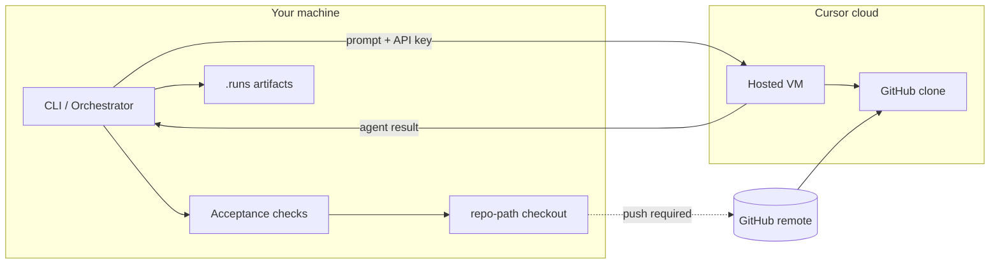

# Security

Security considerations for Cursor Orchestrator, with emphasis on **cloud execution** where agent work runs on Cursor-hosted infrastructure instead of your machine.

## Scope

This document covers:

- What data and capabilities are exposed when you run workflows
- How **local** and **cloud** execution modes differ from a security perspective
- Mitigations built into the orchestrator today
- Known gaps and planned improvements

Operational setup for cloud runs (CLI flags, repo URL resolution) lives in [getting-started.md](getting-started.md#cloud-execution). Runner wiring is in [architecture.md](architecture.md#runner-abstraction).

## Threat model: cloud execution

Cloud mode uses `CursorCloudRunner`, which sends composed phase prompts to the Cursor SDK with `cloud.repos` pointing at a **GitHub repository URL**. Agents run on a Cursor-hosted VM that clones that repo—not your local `--repo-path` checkout.

### Assets at risk

| Asset | Exposure in cloud mode |
|-------|------------------------|
| Repository source | Cloned on the remote VM from the resolved GitHub URL |
| Phase prompts | Sent to Cursor APIs (objective, task text, prior artifacts, skills) |
| `CURSOR_API_KEY` | Used by the orchestrator process on your machine to call the SDK |
| Run artifacts | Written locally under `.runs/<run-id>/` (messages, reports, logs) |
| Local checkout (`--repo-path`) | Used for acceptance checks only; not mounted into the cloud VM |
| Unpushed local commits | **Not visible** to cloud agents unless pushed to the remote |

### Threat actors and scenarios

**Remote agent visibility.** Cursor cloud agents can read and modify files in the cloned repository, run shell commands in the VM, and (depending on Cursor SDK behavior and repo permissions) interact with git remotes. Treat cloud agents like a contributor with write access to the target branch.

**Prompt and context exfiltration.** Phase prompts may include task descriptions, file excerpts from prior artifacts, skill text, and acceptance context. Anything embedded in a prompt is transmitted to Cursor's agent infrastructure. Do not put secrets, credentials, or regulated data in workflow task strings or artifact content intended for agent consumption.

**Repository exfiltration or tampering.** A compromised or mis-prompted agent could commit changes, open pull requests (`autoCreatePR` when enabled), or attempt to read sensitive files present in the cloned repo (including committed secrets—use `.gitignore` and secret scanning on the remote).

**Split-brain local/cloud.** Acceptance checks (`npm test`, Pester, file checks) run **locally** against `--repo-path` while agents edit the **remote** clone. An agent could pass cloud-side work that does not match your local tree until you pull. Always push before cloud runs and pull before trusting acceptance results.

**API key handling.** The orchestrator reads `CURSOR_API_KEY` from the environment (or runner options). Keys in shell history, CI logs, or shared `.env` files are out of scope for orchestrator redaction until they appear in captured output.

**Run artifact leakage.** `.runs/` stores agent transcripts and reports on disk. These may summarize code, errors, or command output from the remote session. Restrict filesystem permissions and add `.runs/` to backup/retention policies as needed.

### Trust boundaries

## Local vs cloud: when to use each

| Prefer **local** (`--execution-mode local`) | Prefer **cloud** (`--execution-mode cloud`) |
|---------------------------------------------|---------------------------------------------|
| Sensitive or air-gapped code that must not leave your machine | Long-running tasks where your workstation should stay free |
| Uncommitted or experimental work not ready to push | CI-style runs against a known GitHub branch state |
| Full fidelity with local-only tools, paths, or credentials | Repos already on GitHub with branch protection and review |
| Tightest control over filesystem and network from the agent | You accept Cursor's cloud isolation model and GitHub as source of truth |

**Dry-run and mock runs.** Use `--dry-run` or inject `MockAgentRunner` when validating workflows without calling Cursor APIs—no remote visibility, no API key required for agent phases.

**Default.** The CLI and library default to `local`. Cloud mode is opt-in per run or via orchestrator configuration.

## Current mitigations

Mitigations apply at different layers. Not all policies constrain cloud agent behavior inside the VM; many protect **local** acceptance execution and artifact persistence.

### Policy gate (local acceptance and artifacts)

| Policy | Module | What it does |
|--------|--------|--------------|
| Command policy | `src/policies/commandPolicy.ts` | Blocks destructive commands (force push, hard reset, `rm -rf`, etc.) in shell and `command` acceptance checks when `enforcePolicy` is enabled |
| File policy | `src/policies/filePolicy.ts` | Blocks paths outside workspace root; blocks `.git/` and `node_modules/` writes; flags sensitive paths (`.env`, keys, credentials) |
| Approval policy | `src/policies/approvalPolicy.ts` | Records approval requests for risky commands, file deletes, and `manual_approval` checks; supports auto-approve flags for tests/CI |

`PolicyGate` (`src/policies/PolicyGate.ts`) enforces command blocks for `NodeShellRunner` and `command` checks. `ArtifactStore` enforces file policy on orchestrator-managed artifact writes.

### Secret redaction (outputs)

`redactSecrets` in `commandPolicy.ts` scrubs common token patterns from:

- Shell stdout/stderr (`NodeShellRunner`)
- Cursor agent results and error messages (`cursorRunnerCore.ts`)

Redaction runs **after** agent or shell execution, before persisting to `.runs/`. It does **not** remove secrets from prompts sent to the API.

### Cloud repo URL validation

`resolveRunRepoUrl` (`src/util/resolveRepoUrl.ts`) requires a normalized **GitHub HTTPS** URL for cloud mode. Non-GitHub remotes are rejected. Cloud runs fail fast if no URL can be resolved—avoiding silent fallback to an ambiguous target.

### Cloud runner defaults

`CursorCloudRunner` (`src/runners/cursorCloudRunner.ts`) sets:

- `skipReviewerRequest: true` by default (reduces automatic reviewer side effects)
- `autoCreatePR: false` by default (PR creation is opt-in)

See [Security considerations](security.md) in that module's header comment when changing cloud defaults.

### Run isolation and audit

Each run writes an isolated directory under `.runs/<run-id>/` with workflow snapshot, state, transcripts, and acceptance reports—supporting review after the fact without relying on cloud VM retention.

## Known gaps and future work

| Gap | Risk | Direction |
|-----|------|-----------|
| Policies do not sandbox cloud agents | Remote VM actions are governed by Cursor SDK, not `PolicyGate` | Document clearly (this page); evaluate SDK-side constraints; optional pre-flight workflow lint for cloud-incompatible acceptance |
| No interactive CLI approval flow | `ApprovalPolicy` requests stay `pending` unless auto-approved | Add pause/resume or explicit approve/deny commands for production runs |
| Prompts not redacted before send | Secrets in task text reach Cursor APIs | Pre-send secret scan on composed prompts; workflow validation warnings |
| Cloud/local drift | Acceptance passes locally while remote branch differs | Optional post-cloud sync check (commit SHA compare) before acceptance |
| Limited secret patterns | Novel token formats may leak into logs | Expand `SECRET_PATTERNS`; allow user-defined patterns |
| `autoCreatePR` and git push | Remote write access when enabled | Stricter defaults; workflow-level gates; branch protection on GitHub |
| Third-party skills in prompts | Bundled `skills/` content is injected into prompts | Review skill content before cloud runs on sensitive repos |

Contributions that close these gaps should extend schemas and policies first, then wire enforcement at documented call sites—see [AGENTS.md](../AGENTS.md).

## Operator checklist

Before a **cloud** run on a sensitive repository:

1. Push the branch you intend agents to use; confirm `--repo-url` or `origin` points at the correct GitHub repo.
2. Remove secrets from task strings, committed files, and artifact templates agents will read.
3. Enable branch protection and required reviews on GitHub for any branch agents can target.
4. Keep `CURSOR_API_KEY` in environment variables, not workflow YAML or committed config.
5. Review `.runs/<run-id>/` artifacts after the run; treat them like security-sensitive logs.
6. Pull remote changes locally before interpreting acceptance check results.

Before a **local** run:

1. Confirm `--repo-path` is the intended workspace; agents use it as `cwd` via `CursorLocalRunner`.
2. Use `--dry-run` or `MockAgentRunner` in CI without live agent access.
3. Leave `enforcePolicy: true` on `NodeShellRunner` unless you have a controlled test harness.

## Related documentation

- [Getting started — Cloud execution](getting-started.md#cloud-execution)
- [Agents — Execution modes](agents.md#execution-modes)
- [Architecture — Runner abstraction and Safety](architecture.md#runner-abstraction)
- [Acceptance criteria — Policy interaction](acceptance-criteria.md#policy-interaction)
